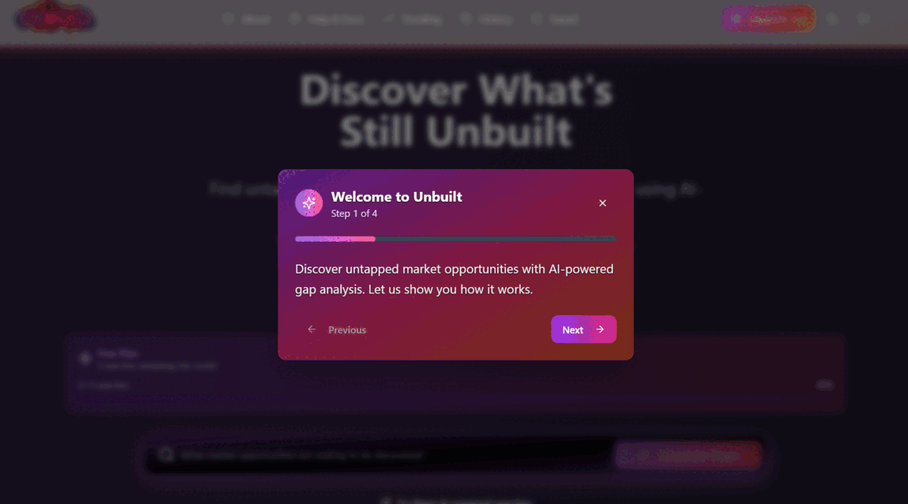

# GitHub Repository Setup Instructions

## Step 1: Create GitHub Repository

1. **Go to GitHub.com**
   - Log into your GitHub account
   - Click "+" → "New repository"

2. **Repository Settings**
   - **Repository name**: `unbuilt` (or your preferred name)
   - **Description**: "AI-powered innovation gap analysis platform with neon flame design"
   - **Visibility**: Public (recommended for portfolio)
   - ✅ **Add README file**: UNCHECKED (we already have one)
   - ✅ **Add .gitignore**: UNCHECKED (we already have one) 
   - **License**: MIT (or leave blank, we have LICENSE file)

3. **Create Repository**
   - Click "Create repository"
   - Copy the repository URL (will be like: `https://github.com/yourusername/unbuilt.git`)

## Step 2: Initialize and Push from Replit

Run these commands in the Replit Shell:

```bash
# Initialize git repository
git init

# Add all files
git add .

# Make initial commit
git commit -m "Initial commit: Unbuilt - Innovation Gap Analysis Platform

- Full-stack React + Express application with TypeScript
- Neon flame theme with mysterious black hole aesthetic  
- AI-powered gap analysis using Google Gemini 2.5 Pro
- PostgreSQL database with Drizzle ORM
- User authentication and subscription system
- Action plan generator and business intelligence features
- Responsive design with custom SVG logo
- Production-ready deployment configuration"

# Add GitHub remote (replace with your repository URL)
git remote add origin https://github.com/yourusername/unbuilt.git

# Push to GitHub
git branch -M main
git push -u origin main
```

## Step 3: Configure Repository Settings

### Repository Topics (for discoverability)
Add these topics to your repository:
```
ai-powered, react, typescript, innovation, market-analysis, 
startup, entrepreneurship, gap-analysis, business-intelligence,
full-stack, postgresql, express, vite, tailwindcss, drizzle-orm
```

### Repository Description
```
🔥 AI-powered innovation gap analysis platform that helps entrepreneurs discover market opportunities and untapped business potential. Features mysterious neon flame design, comprehensive business intelligence, and action plan generation.
```

### Enable GitHub Pages (Optional)
If you want to host documentation:
1. Go to Settings → Pages
2. Source: Deploy from a branch
3. Branch: main, folder: /docs
4. This will make your documentation available at `yourusername.github.io/unbuilt`

## Step 4: Create Demo GIF/Animation

### Quick Option - Use Screen Recording
1. **Install recording tool**:
   - Mac: [Kap](https://getkap.co/) (free)
   - Windows: [ScreenToGif](https://www.screentogif.com/) (free)
   - Online: [RecordScreen.io](https://recordscreen.io/)

2. **Record demo** (follow instructions in `docs/CREATE_DEMO.md`):
   - Go to: https://89a6ca3c-71b2-4a86-94dd-a44feac472df.janeway.prod.repl.run/
   - Record 30-45 second demonstration
   - Show: Landing page → Search → Results → Action plan → Export

3. **Replace placeholder**:
   ```bash
   # Replace the SVG placeholder with your GIF
   mv your_demo.gif docs/demo.gif
   
   # Update README to use the real demo
   # Change: 
   # To:     
   ```

4. **Commit the demo**:
   ```bash
   git add docs/demo.gif README.md
   git commit -m "Add demo animation showing key features"
   git push
   ```

## Step 5: Update Repository Links

### In README.md
Replace the placeholder live demo link:
```markdown
[](https://89a6ca3c-71b2-4a86-94dd-a44feac472df.janeway.prod.repl.run/)
```

### Add Social Preview
1. Go to repository Settings → General
2. Scroll to "Social preview" 
3. Upload an image (1200x630px recommended)
4. Use the demo GIF or create a custom social card

## Step 6: Additional Enhancements

### Create Issues/Project Board
Create some initial issues to show active development:
- [ ] Add user dashboard with analytics
- [ ] Implement Stripe payment integration
- [ ] Add export to PowerPoint feature
- [ ] Create mobile app version
- [ ] Add collaborative workspace features

### Add Badges to README
```markdown
[](https://github.com/yourusername/unbuilt/stargazers)
[](https://github.com/yourusername/unbuilt/network)
[](https://github.com/yourusername/unbuilt/issues)
```

### Create Releases
Tag your first release:
```bash
git tag -a v1.0.0 -m "Initial release: Unbuilt v1.0.0"
git push origin v1.0.0
```

## Step 7: Share Your Repository

Your repository will be ready to share with:
- ✅ Professional README with live demo
- ✅ Comprehensive documentation
- ✅ Clean project structure
- ✅ Demo animation/screenshots
- ✅ MIT license
- ✅ Proper .gitignore
- ✅ Environment configuration
- ✅ Setup instructions

## Repository URL Structure
Your final repository will be accessible at:
- **Repository**: `https://github.com/yourusername/unbuilt`
- **Live Demo**: Your Replit URL
- **Documentation**: `https://yourusername.github.io/unbuilt` (if GitHub Pages enabled)

## Troubleshooting

### Git Authentication Issues
If you get authentication errors:
```bash
# Use personal access token instead of password
# Or set up SSH keys as recommended by GitHub
```

### Large File Issues  
If demo GIF is too large:
```bash
# Check file size
ls -lh docs/demo.gif

# If over 100MB, use Git LFS
git lfs track "*.gif"
git add .gitattributes
```

### README Not Displaying
- Ensure README.md is in root directory
- Check markdown syntax
- Verify image paths are correct

Your Unbuilt repository is now ready for GitHub! 🚀