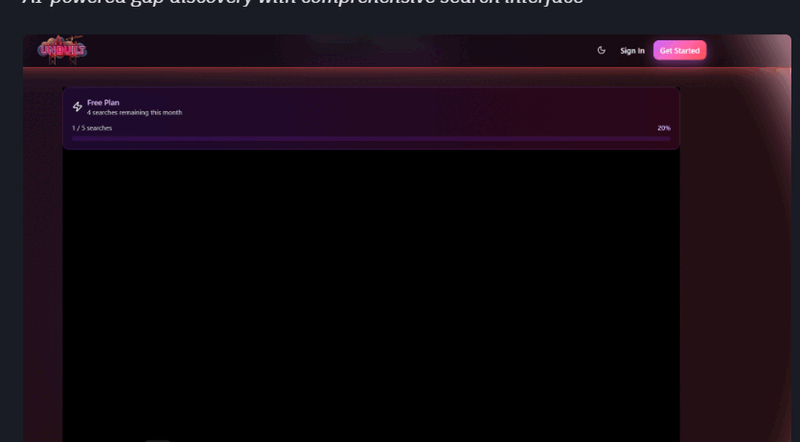
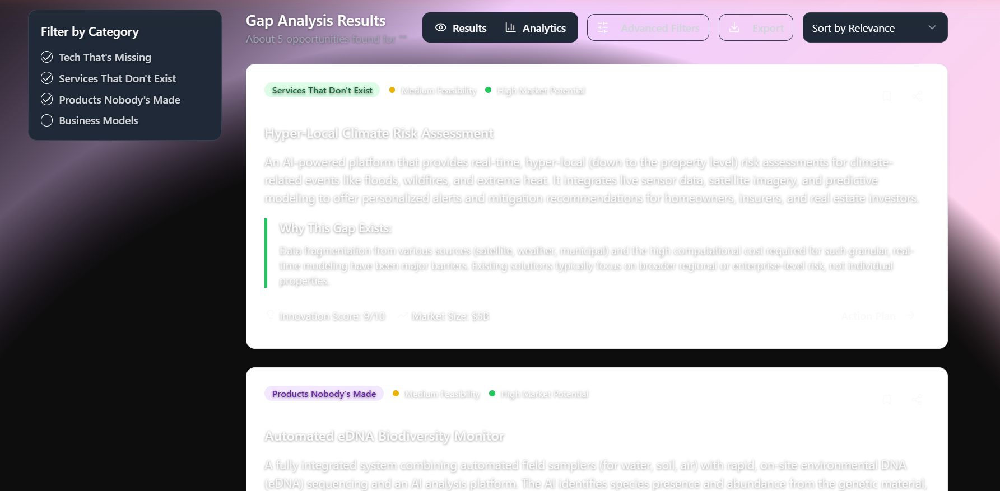
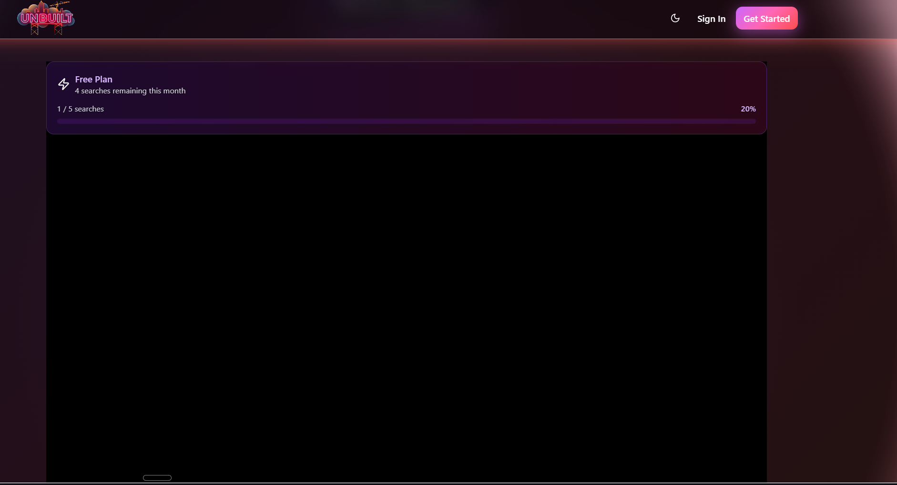

# Unbuilt - Innovation Gap Analysis Platform

[](https://a89c34fb-a499-4213-be44-089e1af5a604-00-3v22fv7gmb01o.janeway.replit.dev/)
[](LICENSE)
[](https://github.com/Stackstudio-cloud/unbuilt.Cloud)

> Discover what doesn't exist yet. Find market gaps and untapped opportunities with AI-powered analysis.



## 🚀 Live Demo

**Try Unbuilt now:** [https://a89c34fb-a499-4213-be44-089e1af5a604-00-3v22fv7gmb01o.janeway.replit.dev/](https://a89c34fb-a499-4213-be44-089e1af5a604-00-3v22fv7gmb01o.janeway.replit.dev/)

Demo credentials for testing:
- **Email:** test@example.com
- **Password:** demo123

## 📸 Platform Demo

The demo GIF above showcases the complete Unbuilt platform journey (3 seconds per frame):
- **Welcome Tour** - Interactive onboarding that introduces users to AI-powered gap discovery
- **Search Interface** - Clean homepage with flame-themed design and intelligent search suggestions
- **Gap Analysis Results** - Detailed market opportunities with innovation scores and feasibility ratings  
- **Action Plans** - Strategic priorities and step-by-step development roadmaps
- **Business Tools** - Resource library with startup tools, funding strategies, and documentation
- **Professional Experience** - Seamless navigation between features with responsive design

### Key Interface Elements

*AI-powered gap discovery with comprehensive search interface*


*Detailed market opportunities with innovation scores and feasibility ratings*

## 🌟 Overview

Unbuilt is a full-stack web application that helps entrepreneurs and innovators identify market gaps and untapped opportunities. Using AI-powered analysis, it discovers what's missing in various industries and markets, providing detailed insights about feasibility, market potential, and innovation opportunities.

### Key Features

- 🔍 **AI-Powered Gap Analysis** - Advanced market research using Google Gemini 2.5 Pro
- 📊 **Comprehensive Insights** - Innovation scores, market potential, and feasibility ratings
- 💼 **Action Plan Generator** - 4-phase development roadmaps for identified opportunities
- 🎯 **Competitive Analysis** - Market positioning insights and competitor landscape
- 📈 **Market Intelligence** - Demographics, growth opportunities, and market sizing
- 📋 **Professional Export** - PDF reports, CSV data, and investor pitch decks
- 🔐 **User Authentication** - Secure registration and login system
- 💰 **Subscription Tiers** - Free (5 searches/month) and Pro (unlimited) plans
- 🎨 **Professional UI** - Enhanced navigation with prominent branding and comprehensive help system
- 📱 **Responsive Design** - Mobile-first approach with hamburger navigation
- 🌙 **Dark Theme** - Neon flame aesthetic with perfect contrast optimization

## 🎨 Design Theme

Unbuilt features a unique "Neon Flame" theme with a mysterious "black hole" aesthetic that perfectly captures the concept of exploring the unknown and discovering what doesn't exist yet. The design uses:

- **Dark Mode First** - Optimized for the neon flame aesthetic
- **Color Palette** - Purple, red, orange, and white flame colors
- **Ultra-dark Gradients** - Creates dramatic contrast and mysterious atmosphere
- **Custom SVG Logo** - Transparent flame-themed branding

## 🚀 Quick Start

### Prerequisites

- Node.js 20+ 
- PostgreSQL database
- Google Gemini API key (optional for development)

### Installation

1. **Clone the repository**
   ```bash
   git clone https://github.com/yourusername/unbuilt.git
   cd unbuilt
   ```

2. **Install dependencies**
   ```bash
   npm install
   ```

3. **Set up environment variables**
   ```bash
   cp .env.example .env
   # Edit .env with your database URL and API keys
   ```

4. **Set up the database**
   ```bash
   npm run db:push
   ```

5. **Start the development server**
   ```bash
   npm run dev
   ```

The application will be available at `http://localhost:5000`

## 🏗️ Architecture

### Tech Stack

**Frontend**
- React 18 with TypeScript
- Vite for fast development
- Radix UI + shadcn/ui components
- Tailwind CSS with custom theme
- TanStack Query for state management
- Wouter for routing

**Backend**
- Node.js with Express.js
- TypeScript with ES modules
- PostgreSQL with Drizzle ORM
- Google Gemini API integration
- RESTful API design

**Database**
- PostgreSQL via Neon Database
- Drizzle ORM with type safety
- Schema migrations with Drizzle Kit

### Project Structure

```
├── client/              # React frontend
│   ├── src/
│   │   ├── components/  # Reusable UI components
│   │   ├── pages/       # Route components
│   │   ├── hooks/       # Custom React hooks
│   │   └── lib/         # Utilities and configurations
├── server/              # Express backend
│   ├── routes.ts        # API routes
│   ├── storage.ts       # Database operations
│   └── vite.ts          # Development server setup
├── shared/              # Shared types and schemas
│   └── schema.ts        # Database schema definitions
└── attached_assets/     # Static assets and logos
```

## 🔧 Development

### Available Scripts

- `npm run dev` - Start development server with hot reload
- `npm run build` - Build for production
- `npm run start` - Start production server
- `npm run db:push` - Push schema changes to database
- `npm run db:studio` - Open Drizzle Studio for database management

### Demo Features

The live demo includes:
- **Full AI Search Functionality** - Real Google Gemini AI integration
- **Complete User Interface** - All pages and features accessible
- **Sample Data** - Pre-loaded search history and results
- **Professional Navigation** - Enhanced header with About and Help pages
- **Responsive Design** - Works perfectly on desktop and mobile devices

### API Endpoints

- `GET /api/auth/user` - Get current user profile
- `POST /api/auth/register` - User registration
- `POST /api/auth/login` - User login
- `POST /api/search` - Create new gap analysis search
- `GET /api/search/:id` - Get search results with detailed analysis
- `GET /api/searches` - Get user's search history
- `POST /api/trial/activate` - Activate free trial for Pro features
- `GET /health` - Health check endpoint

## 📦 Deployment

### Replit Deployment (Recommended)

The application is configured for easy deployment on Replit:

1. Import the repository to Replit
2. Set environment variables in Replit Secrets:
   - `DATABASE_URL` - Your PostgreSQL connection string
   - `GEMINI_API_KEY` - Google Gemini API key
   - `SESSION_SECRET` - Random string for session security
3. Run the application - it will automatically bind to port 5000

**Current Live Demo:** The application is currently deployed and accessible at the demo link above.

### Production Deployment

1. **Build the application**
   ```bash
   npm run build
   ```

2. **Set production environment variables**
   - `DATABASE_URL` - PostgreSQL connection string
   - `GEMINI_API_KEY` - Google Gemini API key
   - `SENDGRID_API_KEY` - SendGrid for email (optional)

3. **Start the production server**
   ```bash
   npm run start
   ```

## 🤝 Contributing

1. Fork the repository
2. Create your feature branch (`git checkout -b feature/AmazingFeature`)
3. Commit your changes (`git commit -m 'Add some AmazingFeature'`)
4. Push to the branch (`git push origin feature/AmazingFeature`)
5. Open a Pull Request

## 📄 License

This project is licensed under the MIT License - see the [LICENSE](LICENSE) file for details.

## 🎯 Use Cases

- **Entrepreneurs** - Identify untapped business opportunities before competitors
- **Startups** - Validate market gaps and find product-market fit
- **Investors** - Discover emerging market trends and investment opportunities
- **Product Managers** - Research white space in existing markets
- **Innovation Teams** - Generate breakthrough ideas for R&D initiatives
- **Market Researchers** - Comprehensive gap analysis with AI-powered insights

## 🙏 Acknowledgments

- Built with modern web technologies and best practices
- UI components powered by Radix UI and shadcn/ui
- AI analysis powered by Google Gemini 2.5 Pro
- Database hosting provided by Neon Database
- Deployed on Replit for seamless development and hosting

## 📞 Support

- **GitHub Issues** - Report bugs and request features
- **Live Demo** - Test all features before implementation
- **Documentation** - Comprehensive help system built into the app

---

**Discover what's missing. Build what's next.** 🚀

*Ready to find your next big opportunity? [Try the live demo now →](https://a89c34fb-a499-4213-be44-089e1af5a604-00-3v22fv7gmb01o.janeway.replit.dev/)*